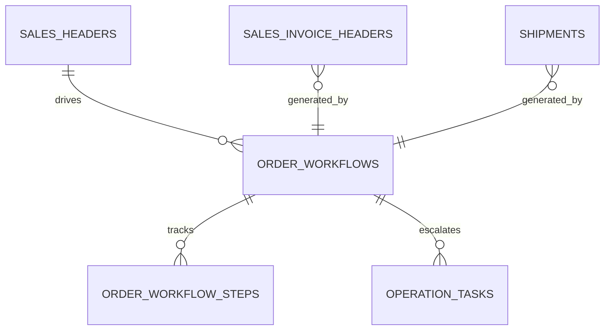

# feat: Cross-module sales to fulfillment orchestration

## Overview

Create an orchestration layer that automates the path from approved sales order to invoice and shipment, reducing manual handoffs between Market, Ledger, and Trace.

## Problem Statement / Motivation

Cross-module workflow exists mainly as manual sequencing in UI/tests, not as a single domain process.

- Checkout, invoice posting, and shipment transitions are currently separate calls.
- Failure handling across modules is manual and non-uniform.
- Operational visibility is fragmented across module dashboards.

## Proposed Solution

Introduce a dedicated orchestration API under Hub (or a shared `workflow` surface) with deterministic step execution:

- `startOrderFulfillment(orderId)`
- `resumeOrderFulfillment(workflowId)`
- `getOrderFulfillmentStatus(workflowId)`

Workflow stages:

1. Validate approved sales order and line integrity.
2. Create/post sales invoice.
3. Create shipment and initial shipment lines.
4. Emit operation task/notification on failure.

## Technical Considerations

- Use idempotent stage keys per order.
- Persist workflow state machine rows for replay and audit.
- Enforce compensation policy per step (delete draft entities when safe).
- Keep stage timeouts and retries configurable.

## System-Wide Impact

- Interaction graph:
  - Market order transitions trigger orchestration; orchestration invokes Ledger and Trace APIs.
- Error propagation:
  - Step failure stores detailed stage error and opens Hub task.
- State lifecycle risks:
  - Avoid “posted invoice but no shipment” orphaned states by resumable stages.
- API surface parity:
  - Existing individual module APIs remain supported; orchestrator composes them.
- Integration scenarios:
  - Retry from failed stage.
  - Duplicate start call for same order.
  - Partial outage in Trace while Ledger succeeds.

## Data Model (Proposed)

## Acceptance Criteria

- [x] Single API starts fulfillment workflow from approved sales order.
- [x] Workflow is idempotent per order.
- [x] Stage state persists and supports resume after transient failure.
- [x] Hub task and notification are created for hard failures.
- [x] Cross-module integration tests cover success and failure/resume flows.

## Success Metrics

- Manual API steps per order reduced from 3+ to 1.
- 100% deterministic workflow state visibility via status endpoint.
- Recovery from stage failure verified in integration tests.

## Dependencies & Risks

- Dependencies:
  - `market`, `ledger`, `trace`, and `hub` routers.
  - Existing cross-module tests.
- Risks:
  - Coupling orchestration to current module-specific field names.
  - Hard-to-debug distributed failures without structured event logs.

## Implementation Phases

### Phase 1: workflow state + orchestration API

- Add workflow state tables in `src/server/db/index.ts`.
- Add orchestration endpoints in `src/server/rpc/router/uplink/hub.router.ts` or new shared router.

### Phase 2: module step adapters

- Add adapters around:
  - `src/server/rpc/router/uplink/market.router.ts`
  - `src/server/rpc/router/uplink/ledger.router.ts`
  - `src/server/rpc/router/uplink/trace.router.ts`

### Phase 3: observability and tests

- Expand `test/uplink/cross-module-workflows.test.ts` for resume/idempotency/failure scenarios.

## Sources & References

- Existing cross-module test baseline:
  - `test/uplink/cross-module-workflows.test.ts`
- Current stage APIs:
  - `src/server/rpc/router/uplink/market.router.ts`
  - `src/server/rpc/router/uplink/ledger.router.ts`
  - `src/server/rpc/router/uplink/trace.router.ts`
- Hub escalation patterns:
  - `src/server/rpc/router/uplink/hub.router.ts`
