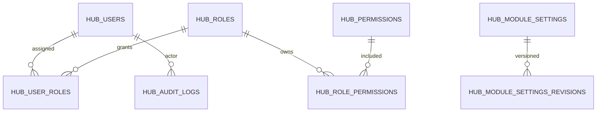

# feat: Hub RBAC settings and audit trails

## Overview

Add real role-based access management, module-level settings, and immutable audit trail capabilities in Hub as the platform control plane.

## Problem Statement / Motivation

Current role checks are runtime rank checks from request context only; there is no persisted RBAC model or admin UI.

- No `users`, `roles`, `permissions`, `roleAssignments` tables.
- No module settings domain for configurable policy per module.
- No immutable audit trail for sensitive actions.

## Proposed Solution

Implement Hub control plane primitives:

- Persistent RBAC model and assignment workflow.
- Module settings store with schema validation per module.
- Central audit logger for write operations and admin actions.

Expose APIs and Hub UI for:

- User-role assignment.
- Permission matrix management.
- Settings update with revision history.
- Audit log search and export.

## Technical Considerations

- Keep existing `assertRole` checks but back them with persisted policy.
- Introduce permission-based checks (`module.action`) for sensitive endpoints.
- Use append-only audit writes with actor, before/after, correlation id.
- Require dual-control for critical role changes in production mode.

## System-Wide Impact

- Interaction graph:
  - All mutation endpoints can emit audit events; Hub reads and filters them.
- Error propagation:
  - Authorization failures should expose actionable, non-sensitive messages.
- State lifecycle risks:
  - Role/permission drift can cause lockouts; include bootstrap admin fallback.
- API surface parity:
  - Existing role ranks remain compatible during migration window.
- Integration scenarios:
  - Permission revoked mid-session.
  - Admin role transfer.
  - Module settings rollback.

## Data Model (Proposed)

## Acceptance Criteria

- [x] Persisted RBAC entities exist with CRUD and assignment APIs.
- [x] Hub UI supports assigning roles and reviewing effective permissions.
- [x] Module settings are editable and versioned with rollback support.
- [x] Audit trail records all privileged actions with actor and timestamp.
- [x] Existing endpoints can enforce permission checks beyond role rank.
- [x] Integration tests cover authorization and audit coverage.

## Success Metrics

- 100% privileged mutations generate audit rows.
- Permission-denied behavior is consistent across modules.
- Role change propagation visible within one request cycle.

## Dependencies & Risks

- Dependencies:
  - `src/server/rpc/router/authz.ts`
  - Hub router and views.
- Risks:
  - Breaking existing assumptions around role hierarchy.
  - Audit payload volume growth and retention strategy.

## Implementation Phases

### Phase 1: schema and policy layer

- Extend `src/server/db/index.ts` with RBAC/settings/audit tables.
- Extend `src/server/rpc/router/authz.ts` for permission checks.

### Phase 2: Hub API + UI

- Implement endpoints in `src/server/rpc/router/uplink/hub.router.ts`.
- Add management views in:
  - `src/app/_shell/_views/hub/dashboard.tsx`
  - `src/app/_shell/_views/hub/tasks-list.tsx`
  - `src/app/_shell/_views/hub/notifications-list.tsx`

### Phase 3: rollout and test hardening

- Add authz coverage in `test/uplink/authz-modules.test.ts`.
- Add audit expectations in per-module mutation tests.

## Sources & References

- Current role rank checks:
  - `src/server/rpc/router/authz.ts`
- Current Hub operations surface:
  - `src/server/rpc/router/uplink/hub.router.ts`
- Existing Hub views:
  - `src/app/_shell/_views/hub/dashboard.tsx`
