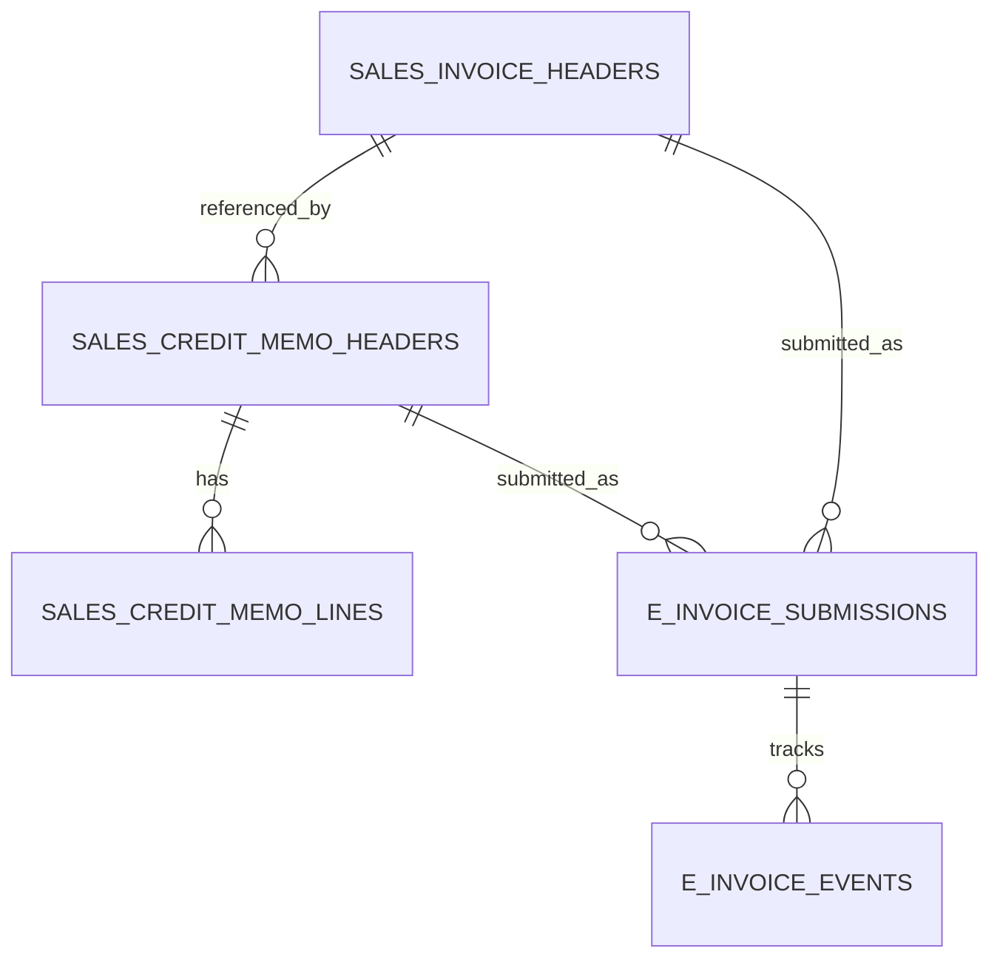

# feat: Ledger credit memos and e-invoicing compliance

## Overview

Extend Ledger with compliant commercial document lifecycle: credit memos, tax document details, and stronger e-invoicing status management.

## Problem Statement / Motivation

Ledger currently supports invoice posting and reversal, but lacks explicit credit memo artifacts and compliance-oriented document states.

- No dedicated credit memo header/line entities.
- No tax breakdown or compliance status model for invoice documents.
- Limited support for regulatory submission/acknowledgment lifecycle.

## Proposed Solution

Add compliance-focused ledger capabilities:

- Credit memo document types with linkage to original invoice.
- Tax detail model per line/document.
- E-invoice processing lifecycle (`DRAFT`, `POSTED`, `SUBMITTED`, `ACCEPTED`, `REJECTED`, `CANCELED`).
- Error and retry workflow for rejected submissions.

## Technical Considerations

- Preserve double-entry accounting invariants on credit memo posting.
- Require reference to original document for credit notes where mandated.
- Keep posting idempotent and auditable.
- Separate tax calculation engine from posting side-effects.

## System-Wide Impact

- Interaction graph:
  - Posting affects customer ledger and GL entries similar to invoice posting with opposite sign patterns.
- Error propagation:
  - Regulatory submission failures should not corrupt local posting state.
- State lifecycle risks:
  - Duplicate credit memos and mismatched balances if linkage rules are weak.
- API surface parity:
  - Keep invoice APIs intact; add credit memo and compliance sub-routers.
- Integration scenarios:
  - Partial credit memo.
  - Full credit against posted invoice.
  - Submission reject and retry.

## Data Model (Proposed)

## Acceptance Criteria

- [x] Credit memo header/line entities are available with posting flow.
- [x] Credit memo posting creates balancing customer ledger and GL entries.
- [x] Tax detail fields exist and are validated for invoice/credit memo docs.
- [x] E-invoice lifecycle statuses and retry flow are implemented.
- [x] Integration tests cover posting, reversal, and rejection/retry scenarios.

## Success Metrics

- Accurate financial offsets for all credit memo test cases.
- No duplicate submission records for retryable e-invoice attempts.
- Compliance status visibility in Ledger UI list/detail pages.

## Dependencies & Risks

- Dependencies:
  - Existing invoice posting flow in ledger router.
  - Customer ledger and GL table conventions.
- Risks:
  - Regulatory variation by locale.
  - Incorrect sign handling in reversal/credit accounting.

## Implementation Phases

### Phase 1: schema and posting core

- Extend schema in `src/server/db/index.ts`.
- Add posting endpoints in `src/server/rpc/router/uplink/ledger.router.ts`.

### Phase 2: UI and document lifecycle

- Extend ledger views:
  - `src/app/_shell/_views/ledger/invoices-list.tsx`
  - `src/app/_shell/_views/ledger/dashboard.tsx`
  - Add credit memo list/card views.

### Phase 3: compliance workflow hardening

- Add submission event store and retry policies.
- Add tests in `test/uplink/ledger-modules.test.ts`.

## Sources & References

- Existing invoice posting logic:
  - `src/server/rpc/router/uplink/ledger.router.ts`
- Current ledger UI surfaces:
  - `src/app/_shell/_views/ledger/dashboard.tsx`
  - `src/app/_shell/_views/ledger/invoices-list.tsx`
- Existing accounting entities:
  - `src/server/db/index.ts`
