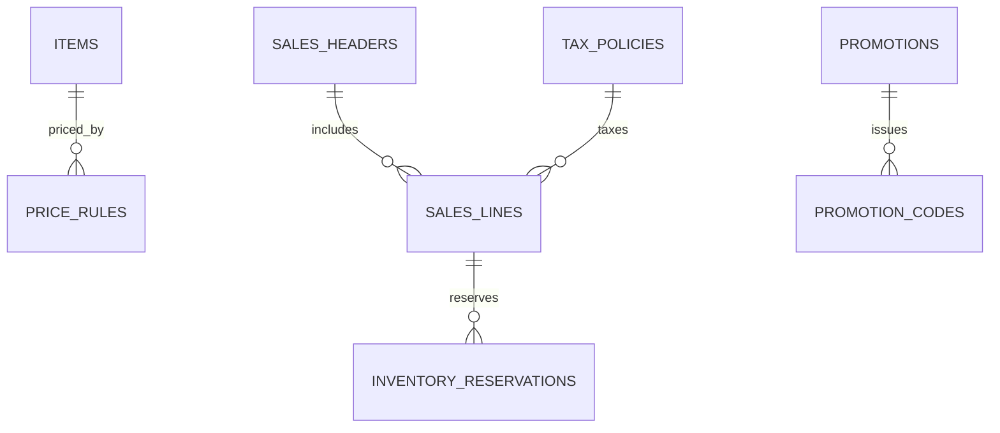

# feat: Market pricing promotions tax and reservations

## Overview

Implement advanced commercial controls in Market: pricing rules, promotions, tax policy, and inventory reservation lifecycle.

## Problem Statement / Motivation

Market supports base unit price and line discounts, but lacks enterprise-grade pricing and reservation controls.

- No promo/coupon entities and rule engine.
- No tax policy model by jurisdiction/channel.
- No reservation ledger for pre-allocation and release.

## Proposed Solution

Add a pricing/tax/reservation domain layer:

- Price lists and price rules with effective dates.
- Promotion/coupon engine with stackability rules.
- Tax policy resolver for order lines.
- Inventory reservation records linked to sales lines.

## Technical Considerations

- Pricing engine should be deterministic and side-effect free.
- Tax calculation should be versioned and auditable per order line.
- Reservation should prevent oversell and support release/expire.
- Keep POS and Market alignment for pricing/tax behavior where shared.

## System-Wide Impact

- Interaction graph:
  - Sales order line pricing now depends on rule evaluation + tax resolution + reservation write.
- Error propagation:
  - Invalid promo/tax config must block checkout/order completion clearly.
- State lifecycle risks:
  - Stale reservations and stock drift under canceled orders.
- API surface parity:
  - Extend market APIs, expose derived values in UI and downstream modules.
- Integration scenarios:
  - Promo conflict precedence.
  - Reservation release on cancel.
  - Backorder behavior when stock unavailable.

## Data Model (Proposed)

## Acceptance Criteria

- [x] Price rules and promotions can be configured and evaluated on sales lines.
- [x] Tax policy is resolved and persisted on each order line.
- [x] Reservation records are created on order submit and released on cancel.
- [x] Oversell prevention rules are enforced in order workflows.
- [x] Market and POS totals align for common pricing/tax scenarios.
- [x] Integration tests validate pricing, tax, and reservation edge cases.

## Success Metrics

- Correct pricing and tax totals in all covered scenarios.
- Reservation mismatch incidents reduced to zero in tests.
- Promotion adoption visibility on Market dashboards.

## Dependencies & Risks

- Dependencies:
  - Existing item/sales schemas and market router.
  - Replenishment inventory signals.
- Risks:
  - Complex rule precedence producing inconsistent totals.
  - Performance impact if rule engine is not optimized.

## Implementation Phases

### Phase 1: pricing and promotion engine

- Add schema + evaluation service in `src/server` and `src/server/db/index.ts`.
- Add endpoints in `src/server/rpc/router/uplink/market.router.ts`.

### Phase 2: tax and reservation workflows

- Extend order create/update logic with tax + reservation writes.
- Update forms in `src/app/_shell/_views/market/components/sales-order-card.tsx`.

### Phase 3: UI and tests

- Add management views for promotions/rules.
- Add tests in `test/uplink/market-modules.test.ts` and cross-module flows.

## Sources & References

- Current market API and checkout:
  - `src/server/rpc/router/uplink/market.router.ts`
- Current item/sales schema fields:
  - `src/server/db/index.ts`
- Current order UI:
  - `src/app/_shell/_views/market/components/sales-order-card.tsx`
- POS pricing/tax behavior:
  - `src/app/_shell/_views/pos/hooks/use-pos-terminal.ts`
