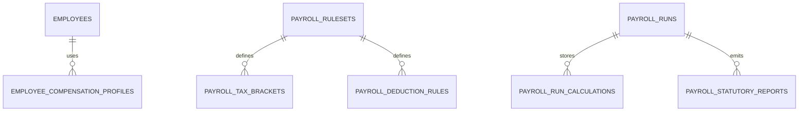

# feat: Payroll compliance and statutory reporting

## Overview

Expand Payroll from simplified gross-to-net processing into compliance-ready payroll with rule packs, tax logic, and statutory reporting outputs.

## Problem Statement / Motivation

Current payroll calculation uses a fixed deduction percentage and lacks jurisdictional compliance artifacts.

- No tax table/rule engine per jurisdiction.
- No statutory filing/report outputs.
- Limited support for pre-tax/post-tax deductions and benefits.

## Proposed Solution

Implement compliance-grade payroll domain:

- Payroll rule sets by jurisdiction and effective date.
- Tax bracket and contribution tables.
- Deduction/benefit catalog and employee assignments.
- Reporting pipeline for statutory summaries and payment files.

## Technical Considerations

- Version payroll calculations for audit reproducibility.
- Persist per-employee calculation breakdowns.
- Keep posting interfaces compatible with existing ledger/bank flows.
- Enforce approval gates before posting and payment.

## System-Wide Impact

- Interaction graph:
  - Payroll runs read employee contracts/rules, write detailed calculation artifacts, then post to ledgers.
- Error propagation:
  - Rule misconfiguration must fail runs with precise validation output.
- State lifecycle risks:
  - Retroactive corrections can desync posted entries if not versioned.
- API surface parity:
  - Keep `calculateRun`/`postRun`/`markRunPaid` semantics, enrich payloads.
- Integration scenarios:
  - Mid-period salary or tax changes.
  - Off-cycle run.
  - correction/adjustment run after posting.

## Data Model (Proposed)

## Acceptance Criteria

- [x] Payroll calculations use configurable rulesets instead of fixed 20% deduction.
- [x] Calculation snapshots include tax/deduction breakdown per employee.
- [x] Statutory report artifacts can be generated per run period.
- [x] Payroll run adjustments/corrections are supported with audit history.
- [x] Existing posting and payment flows remain compatible.
- [x] Integration tests validate multi-rule and adjustment scenarios.

## Success Metrics

- Payroll calculation reproducibility from versioned inputs is 100% in tests.
- Statutory report generation succeeds for all supported templates.
- Regression-free compatibility with existing payroll posting path.

## Dependencies & Risks

- Dependencies:
  - Existing payroll run schema and router.
  - Ledger and bank disbursement posting flows.
- Risks:
  - Jurisdiction complexity growth.
  - Backward compatibility of existing run records.

## Implementation Phases

### Phase 1: compliance schema and rule engine

- Extend payroll schema in `src/server/db/index.ts`.
- Add calculation services under `src/server`.

### Phase 2: payroll API extensions

- Extend `src/server/rpc/router/uplink/payroll.router.ts` with ruleset-aware calculations and reporting endpoints.

### Phase 3: UI and reporting workflows

- Extend payroll views:
  - `src/app/_shell/_views/payroll/payroll-journal.tsx`
  - `src/app/_shell/_views/payroll/dashboard.tsx`
- Add compliance reporting views/export actions.

### Phase 4: tests and migration

- Expand `test/uplink/payroll-modules.test.ts` with rule and adjustment scenarios.
- Add data migration strategy for legacy payroll runs.

## Sources & References

- Current payroll run lifecycle:
  - `src/server/rpc/router/uplink/payroll.router.ts`
- Current payroll schema:
  - `src/server/db/index.ts`
- Current payroll UI:
  - `src/app/_shell/_views/payroll/payroll-journal.tsx`
