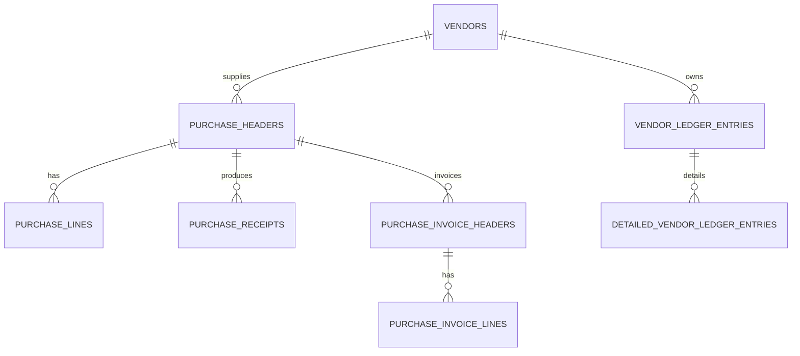

# feat: Replenishment procure-to-pay lifecycle

## Overview

Implement a complete procure-to-pay lifecycle in Replenishment: PO approval, receipt posting, purchase invoice creation/posting, and vendor ledger generation.

## Problem Statement / Motivation

Current replenishment supports purchase headers/lines and proposal generation, but does not complete downstream financial lifecycle.

- Missing receipt posting workflow for PO lines.
- Missing purchase invoice entities and posting actions.
- Missing vendor ledger and detailed vendor ledger entries.

## Proposed Solution

Add finance-linked purchasing lifecycle components:

- PO receipt endpoint: receive quantities into inventory/ledger.
- Purchase invoice header/line domain models linked to PO.
- Posting endpoint that generates vendor ledger and detailed entries.
- Status transition rules aligned with receipt/invoice progression.

## Technical Considerations

- Keep PO and invoice posting idempotent.
- Require reconciliation checks between received and invoiced quantities.
- Maintain traceable linkage keys: `purchaseOrderNo`, `vendorId`, `invoiceNo`.
- Reuse existing transition and role-guard patterns.

## System-Wide Impact

- Interaction graph:
  - Replenishment receipt and invoice posting affects inventory (`insight` read models) and finance (`ledger`/payables views).
- Error propagation:
  - Reject over-receipt and over-invoice conditions with explicit domain errors.
- State lifecycle risks:
  - Partial posting can orphan payable entries; must be rollback-safe.
- API surface parity:
  - Add new router scopes under `replenishment` without breaking current CRUD callers.
- Integration scenarios:
  - Partial receive, full receive, invoice after receive, reverse/cancel invoice.

## Data Model (Proposed)

## Acceptance Criteria

- [x] Receive action updates `quantityReceived` and blocks over-receipt.
- [x] Purchase invoices can be created from received PO quantities.
- [x] Posting purchase invoice creates vendor ledger + detailed ledger entries.
- [x] Idempotent re-run of posting does not duplicate entries.
- [x] Replenishment dashboard reflects received/invoiced/open balances.
- [x] Integration tests validate full procure-to-pay happy path and rollback path.

## Success Metrics

- 100% green procure-to-pay integration suite.
- 0 duplicate payable entries on retry scenarios.
- PO-to-invoice cycle time visible in module KPI panels.

## Dependencies & Risks

- Dependencies:
  - Existing replenishment tables and router.
  - Shared GL/vendor-facing accounting conventions.
- Risks:
  - Schema expansion and relationship drift if keys are inconsistent.
  - Posting logic overlap with ledger module responsibilities.

## Implementation Phases

### Phase 1: schema and router foundations

- Add tables and indexes in `src/server/db/index.ts`.
- Add router scopes and posting endpoints in `src/server/rpc/router/uplink/replenishment.router.ts`.

### Phase 2: UI and workflow transitions

- Add receive/invoice actions in:
  - `src/app/_shell/_views/replenishment/purchase-orders-list.tsx`
  - `src/app/_shell/_views/replenishment/components/purchase-order-card.tsx`

### Phase 3: tests and cross-module validation

- Add tests:
  - `test/uplink/replenishment-modules.test.ts`
  - `test/uplink/cross-module-workflows.test.ts`

## Sources & References

- Replenishment proposal endpoints:
  - `src/server/rpc/router/uplink/replenishment.router.ts`
- Existing purchase entities:
  - `src/server/db/index.ts`
- Existing accounting posting patterns:
  - `src/server/rpc/router/uplink/ledger.router.ts`
  - `src/server/rpc/router/uplink/payroll.router.ts`
