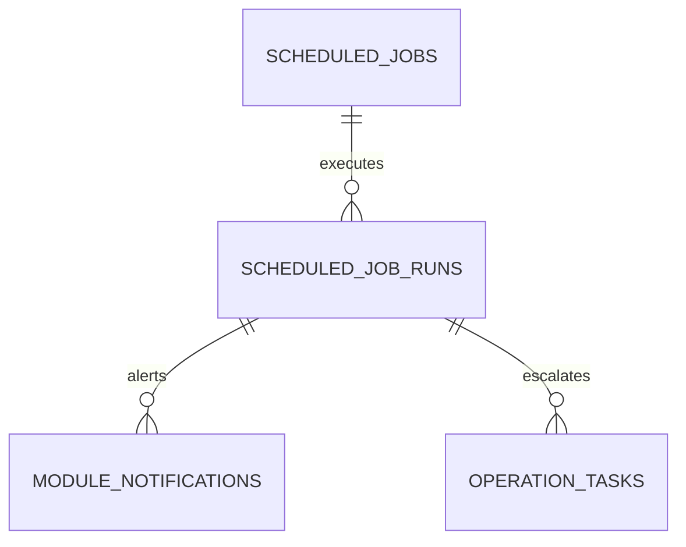

# feat: Scheduled automation for operations and planning

## Overview

Introduce server-side scheduled jobs for periodic operations: replenishment proposal generation, Hub SLA evaluation, and analytics snapshot generation.

## Problem Statement / Motivation

Current capabilities are callable but mostly manual-trigger from UI and ad hoc mutation calls.

- SLA evaluation exists but requires explicit invocation.
- Replenishment planning exists but is not scheduled.
- Forecast outputs are generated on demand only.

## Proposed Solution

Add a lightweight scheduler and job runtime that executes named tasks on defined cadences.

Initial jobs:

- `replenishment.generatePurchaseProposals` (daily)
- `replenishment.generateTransferProposals` (daily)
- `hub.evaluateSlaBreaches` (hourly)
- `flow.analytics.cashForecast` snapshot (daily analytics snapshot only)

Note: This plan excludes real bank integration and auto reconciliation matching.

## Technical Considerations

- Use persistent job definitions and last-run metadata.
- Enforce idempotent task execution per window.
- Create job run logs and failure retry policy.
- Make schedules configurable from Hub settings.

## System-Wide Impact

- Interaction graph:
  - Scheduler triggers existing module endpoints and writes run logs.
- Error propagation:
  - Failed jobs should open Hub operations tasks and notifications.
- State lifecycle risks:
  - Duplicate runs for same window must be prevented.
- API surface parity:
  - Keep manual triggers available for operators.
- Integration scenarios:
  - Missed run replay.
  - Retry after transient error.
  - disabled job should not execute.

## Data Model (Proposed)

## Acceptance Criteria

- [x] Scheduler can register and execute recurring jobs.
- [x] Every run stores status, startedAt, finishedAt, and error summary.
- [x] Duplicate execution for same cadence window is blocked.
- [x] Hub UI can enable/disable jobs and inspect recent runs.
- [x] Automated runs create notifications/tasks on failures.
- [x] Integration tests validate scheduler idempotency and retries.

## Success Metrics

- At least 95% successful scheduled runs in test simulation.
- 0 duplicate run records per job window.
- SLA breach checks run without manual intervention.

## Dependencies & Risks

- Dependencies:
  - Existing endpoint contracts in Hub/Replenishment/Flow.
- Risks:
  - Long-running jobs impacting request resources.
  - Time-zone and cadence boundary bugs.

## Implementation Phases

### Phase 1: scheduler runtime and storage

- Add schedule tables in `src/server/db/index.ts`.
- Add runtime service under `src/server` for cadence execution.

### Phase 2: job adapters

- Wire adapters to:
  - `src/server/rpc/router/uplink/replenishment.router.ts`
  - `src/server/rpc/router/uplink/hub.router.ts`
  - `src/server/rpc/router/uplink/flow.router.ts`

### Phase 3: Hub operations UI and tests

- Add scheduler control panel in Hub views.
- Add tests in `test/uplink/hub-modules.test.ts` and scheduler-focused suite.

## Sources & References

- Existing SLA evaluation endpoint:
  - `src/server/rpc/router/uplink/hub.router.ts`
- Existing replenishment generation endpoints:
  - `src/server/rpc/router/uplink/replenishment.router.ts`
- Existing cash forecast analytics endpoint:
  - `src/server/rpc/router/uplink/flow.router.ts`
