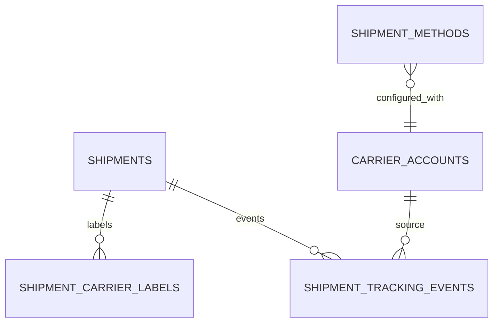

# feat: Trace carrier integration and delivery KPIs

## Overview

Upgrade Trace from internal shipment tracking to carrier-connected logistics orchestration with shipment labels, tracking events, and KPI analytics.

## Problem Statement / Motivation

Current Trace has shipment methods and status transitions but no real carrier integration layer.

- No carrier account/config entities.
- No shipping label/rate generation APIs.
- No external tracking event ingestion/webhooks.

## Proposed Solution

Add carrier abstraction and event-driven tracking:

- Carrier connector interface (rate quote, label purchase, tracking pull/webhook).
- Shipment event timeline persisted per shipment.
- Delivery KPI dataset for on-time %, exception rates, and carrier performance.

## Technical Considerations

- Provider-agnostic connector API with per-carrier adapters.
- Signed webhook validation and replay protection.
- Idempotent event ingestion keyed by carrier event id.
- Async background sync job for carriers without webhook support.

## System-Wide Impact

- Interaction graph:
  - Shipment creation optionally triggers rate/label operations and tracking registration.
- Error propagation:
  - External API failures become operator tasks in Hub and shipment exceptions.
- State lifecycle risks:
  - Duplicate carrier events and out-of-order event streams.
- API surface parity:
  - Keep existing shipment CRUD and transition endpoints.
- Integration scenarios:
  - Webhook retry duplicates.
  - Label purchase success with delayed tracking activation.
  - Carrier outage fallback.

## Data Model (Proposed)

## Acceptance Criteria

- [x] Carrier account configuration is persisted and manageable.
- [x] Label and rate quote APIs are available for supported carriers.
- [x] Webhook/ingestion endpoint stores tracking events idempotently.
- [x] Shipment timeline UI shows normalized event history.
- [x] Delivery KPIs include carrier-level on-time and exception metrics.
- [x] Integration tests cover webhook validation and duplicate event handling.

## Success Metrics

- Tracking event ingestion dedupe rate remains 100% on replay tests.
- Carrier-level KPI cards available in Trace dashboard.
- Mean time to identify delayed shipments reduced via event alerts.

## Dependencies & Risks

- Dependencies:
  - Existing trace shipment and method entities.
  - Hub notification/task escalation surfaces.
- Risks:
  - External carrier API drift.
  - Sensitive credential management requirements.

## Implementation Phases

### Phase 1: connector and schema foundations

- Add carrier-related entities in `src/server/db/index.ts`.
- Extend `src/server/rpc/router/uplink/trace.router.ts` with connector-facing endpoints.

### Phase 2: event ingestion and UI

- Add tracking event ingestion endpoints.
- Extend Trace views:
  - `src/app/_shell/_views/trace/shipments-list.tsx`
  - `src/app/_shell/_views/trace/dashboard.tsx`
  - `src/app/_shell/_views/trace/components/shipment-card.tsx`

### Phase 3: KPI analytics and operations

- Add carrier KPI aggregations and alert thresholds.
- Add tests in `test/uplink/trace-modules.test.ts`.

## Sources & References

- Existing trace API and transition notifications:
  - `src/server/rpc/router/uplink/trace.router.ts`
- Existing trace UI:
  - `src/app/_shell/_views/trace/dashboard.tsx`
  - `src/app/_shell/_views/trace/shipments-list.tsx`
- Existing shipment schema:
  - `src/server/db/index.ts`
