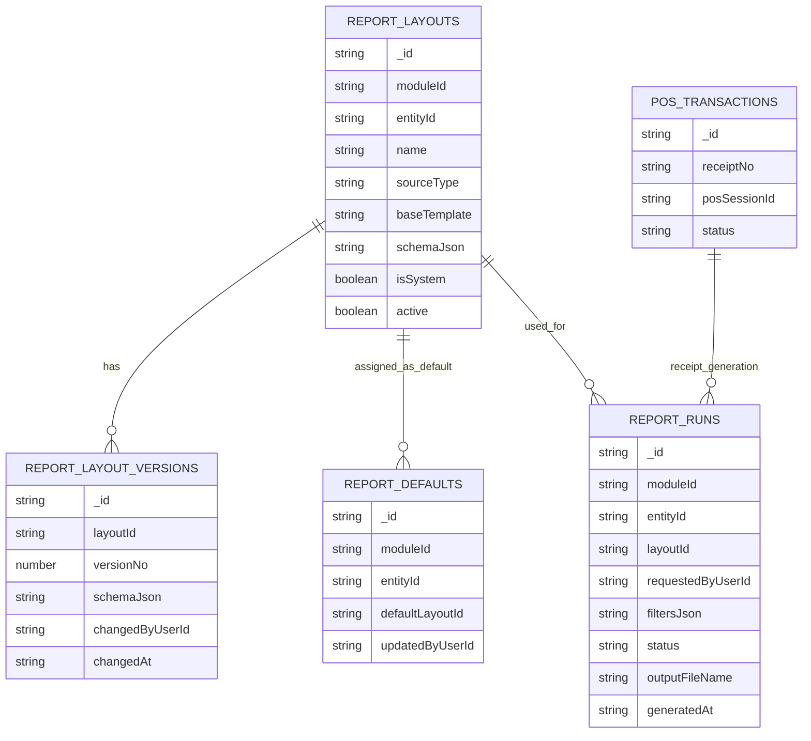
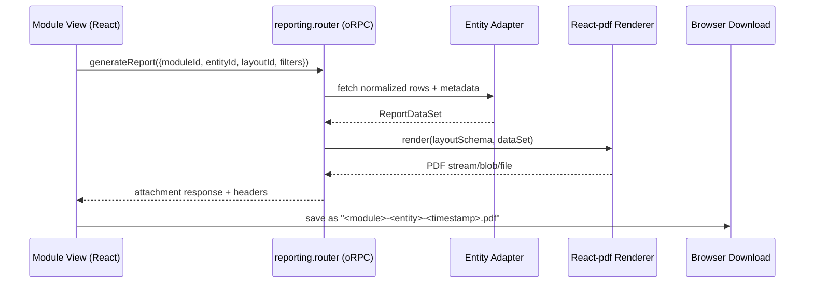

# feat: Server-side reporting, POS ticket download, and mutation toast UX

## Enhancement Summary

**Deepened on:** 2026-02-27  
**Sections enhanced:** 10  
**Skills and research lenses applied:** `vercel-react-best-practices`, `vercel-composition-patterns`, `web-design-guidelines`, `security-sentinel`, `performance-oracle`, `architecture-strategist`, `kieran-typescript-reviewer`, `agent-native-architecture`, `framework-docs-researcher`, `best-practices-researcher`, `pattern-recognition-specialist`.

### Key Improvements

1. Strengthened file transport architecture with concrete oRPC constraints (batch fallback behavior, response-header usage, and large-file handling).
2. Added production-grade report rendering and layout versioning guidance (typed schema blocks, preview strategy, and server/client render boundaries).
3. Hardened POS and mutation UX flows with idempotent receipt recovery, offline-safe behavior, and centralized toast policies to reduce UX ambiguity.

### New Considerations Discovered

- oRPC batch processing can auto-fallback for unsupported file/blob response types; this must still be validated with this repo’s transport stack before full rollout.
- React-pdf rendering has distinct server and browser performance constraints (streaming on server, worker recommendation for large browser renders).
- Toast strategy needs clear severity thresholds to avoid “notification fatigue” while still guaranteeing mutation clarity.

## Overview

Implement a cross-module reporting foundation that renders PDFs on the server, allows user-customizable report layouts (starting from 3 built-in templates), auto-downloads POS receipts after successful sales, and standardizes Sonner toast feedback for mutations across modules.

This plan intentionally combines three related UX gaps into one cohesive delivery:

1. No generic reporting workflow across modules/entities.
2. POS checkout does not trigger ticket download/print-ready receipt.
3. Mutations are inconsistently surfaced to users (success/error/pending).

## Problem Statement

Current behavior is partially implemented and fragmented:

- Reporting exists only in payroll-specific form (`payrollRunStatutoryReports` artifacts), not as a reusable report engine for all modules/entities.
- POS transaction creation uses `receiptNo`, but checkout flow does not download or present a printable ticket after sale completion.
- Mutation feedback is inconsistent:
  - `useEntityMutations` shows `toast.error` only in the optimistic callback path.
  - Many custom `mutateAsync` calls provide no success toast.
  - POS mutations run with `enableOptimistic: false`, so they skip current error toast logic.

## Research Findings

### Local Repository Findings

- oRPC handler already includes `ResponseHeadersPlugin` and context supports `resHeaders`:
  - `src/server/rpc/index.ts`
  - `src/server/rpc/init.ts`
  - `src/server/rpc/router/health.router.ts`
- Existing payroll report generation persists JSON artifacts but does not render downloadable PDFs:
  - `src/server/rpc/router/uplink/payroll.router.ts`
  - `src/server/db/index.ts` (`payrollRunStatutoryReports`)
- POS sale flow creates transactions/lines and transitions to `COMPLETED`, but no receipt download step:
  - `src/app/_shell/_views/pos/hooks/use-pos-terminal.ts`
  - `src/server/rpc/router/uplink/pos.router.ts`
- Toaster is globally mounted, so UX feedback can be standardized centrally:
  - `src/components/layout/providers.tsx`
- Existing `downloadFile` helper logic can be reused for client-side file save UX:
  - `src/components/data-grid/data-grid-export.tsx`

### Institutional Learnings

- No `docs/solutions/` directory exists in this repository at planning time, so no institutional learnings file was available to reuse.

### External Documentation Findings

- oRPC supports typed File/Blob input/output and has dedicated file upload/download guidance.
- oRPC `ResponseHeadersPlugin` injects `resHeaders` into context, which can be used for `Content-Disposition` and related headers.
- React-pdf supports:
  - Node rendering (`renderToStream`, `renderToString`) for server-side generation.
  - Web-side on-the-fly download patterns (`PDFDownloadLink`, `BlobProvider`, `pdf(...).toBlob()`, `usePDF`) for preview and custom download UX.

## Scope

### In Scope

- Reusable report generation for module/entity datasets.
- Built-in layout templates (minimum 3):
  - `BLANK_EMPTY`
  - `A4_SUMMARY`
  - `THERMAL_RECEIPT`
- User-customizable layout persistence and default-layout assignment per entity.
- POS ticket download after completed sale (online path) and reprint path.
- Mutation toast standardization for CRUD/custom mutations.

### Out of Scope (for v1)

- Full WYSIWYG drag-and-drop desktop-publishing editor.
- Background report queues for all report types.
- Non-PDF export formats (CSV/XLS can remain via existing grid export for now).

## SpecFlow Analysis

### User Flow Overview

1. Reporting admin configures layout:
- Select module + entity.
- Start from one of 3 system templates.
- Edit layout sections/properties.
- Save version and set as default.

2. Operator generates report from list/detail context:
- Click `Generate report` in module view.
- Choose filters/date range/layout.
- Server renders PDF and returns file.
- Browser downloads PDF with contextual filename.

3. POS cashier completes sale (online):
- Checkout creates transaction/lines and transitions status to `COMPLETED`.
- Receipt endpoint renders `THERMAL_RECEIPT` PDF.
- File auto-downloads and success toast confirms result.

4. POS cashier completes sale (offline):
- Sale is queued.
- Toast indicates queued/offline status.
- After sync success, receipt generation can be triggered via explicit `Download queued receipts` or per-transaction `Reprint` action.

5. Mutation feedback flow:
- Pending: optional loading toast or inline pending state.
- Success: success toast with operation label.
- Failure: error toast with actionable message.

### Flow Permutations Matrix

| Flow | User Role | Online | Offline | Expected Outcome |
| --- | --- | --- | --- | --- |
| Generate entity report | VIEWER+ | Yes | No | Downloadable PDF |
| Edit layout template | MANAGER/ADMIN | Yes | No | New layout version persisted |
| Set default entity layout | MANAGER/ADMIN | Yes | No | Default used in future generation |
| POS complete sale | AGENT/CASHIER | Yes | Yes | Online: immediate receipt; Offline: queued + later reprint |
| Generic mutation | AGENT+ | Yes | Partial | Toast success/error shown consistently |

### Missing Elements and Gaps

- Report dataset contract is not yet standardized across modules.
- No reusable schema for report layout definition/versioning.
- POS receipt trigger point exists but artifact generation contract does not.
- Mutation feedback policy (when to show success toast vs silent success) is undefined.
- File download behavior under oRPC batching path requires compatibility validation.

### Critical Questions Requiring Clarification

1. Critical: Should all modules expose reporting immediately, or should v1 launch with a subset (`market`, `ledger`, `pos`, `payroll`) and scaffold others?
- Why it matters: Impacts timeline and schema adapter breadth.
- Default assumption if unanswered: Launch with high-traffic modules first, keep adapters pluggable for fast follow.

2. Critical: Is layout editing expected to be freeform drag-and-drop in v1?
- Why it matters: Massive scope multiplier.
- Default assumption if unanswered: v1 uses structured layout schema editor (sections/fields/styles), not pixel-canvas editor.

3. Important: Should every mutation show success toasts, or only destructive/high-value actions?
- Why it matters: Avoid notification noise.
- Default assumption if unanswered: Success toasts for create/delete/status transitions and business actions; silent for low-impact inline edits.

4. Important: Offline POS receipt behavior preference.
- Why it matters: Cannot guarantee immediate server PDF while offline.
- Default assumption if unanswered: queue sale now, provide reprint/download after sync.

### Recommended Next Steps from SpecFlow

- Lock role/permission matrix for report layout management.
- Approve structured-layout scope for v1.
- Confirm module rollout order for report adapters.
- Confirm mutation toast policy thresholds.

## Proposed Solution

### Architecture

Introduce a shared reporting subsystem under server + shared client utilities:

- Report definition and layout persistence.
- Module/entity adapter registry to fetch normalized report rows.
- React-pdf renderer layer (server-side rendering + client preview support).
- oRPC procedures returning File/Blob plus `Content-Disposition` headers.
- POS receipt integration as a specialized report profile using `THERMAL_RECEIPT` template.
- Mutation feedback utility integrated with `useEntityMutations` and custom procedures.

### Data Model (ERD)



Notes:

- `REPORT_RUNS` can start as metadata-only (no blob persistence) to keep storage simple.
- Generated files can be rendered on demand and streamed/downloaded directly.

## Technical Approach

### Phase 0: Compatibility Spike (Mandatory)

Goal: Validate binary/file transfer behavior with current oRPC client setup (`RPCLink` + `BatchLinkPlugin`).

Tasks:

- Add temporary spike procedure returning a small `File` object.
- Confirm browser-side download handling from existing client.
- Validate whether batching must be disabled for file endpoints.

Deliverables:

- Decision note in plan comments or follow-up PR description: `RETURN_FILE_VIA_ORPC` or `FALLBACK_TO_NON_BATCH_DOWNLOAD_PATH`.

### Phase 1: Reporting Domain Foundation

Files:

- `src/server/db/index.ts`
- `src/server/rpc/router/uplink/hub.router.ts` or `src/server/rpc/router/uplink/[module].router.ts` (shared entry)
- `test/uplink/reporting-modules.test.ts` (new)

Tasks:

- Add new tables:
  - `reportLayouts`
  - `reportLayoutVersions`
  - `reportDefaults`
  - `reportRuns`
- Seed system templates:
  - `BLANK_EMPTY`
  - `A4_SUMMARY`
  - `THERMAL_RECEIPT`
- Add role guardrails:
  - layout CRUD: `MANAGER`+
  - report generation: `VIEWER`+

### Phase 2: Server-Side Report Rendering (React-pdf)

Files:

- `src/server/reporting/layout-schema.ts`
- `src/server/reporting/template-library.tsx`
- `src/server/reporting/report-renderer.tsx`
- `src/server/reporting/entity-adapters/[module]/[entity].ts`
- `src/server/rpc/router/uplink/reporting.router.ts` (new)

Tasks:

- Build layout schema validator (zod).
- Build template compiler mapping schema -> React-pdf primitives.
- Build entity adapter registry for normalized rows/metadata.
- Implement procedures:
  - `listLayouts`
  - `createLayout`
  - `saveLayoutVersion`
  - `setDefaultLayout`
  - `generateReport`
  - `downloadReport`
- Set file headers via `context.resHeaders`:
  - `Content-Type: application/pdf`
  - `Content-Disposition: attachment; filename=...`

### Phase 3: Report Center + Layout Editor UI

Files:

- `src/app/_shell/_views/_shared/reporting/report-center.tsx` (new)
- `src/app/_shell/_views/_shared/reporting/layout-editor.tsx` (new)
- `src/app/_shell/_views/_shared/reporting/layout-preview.tsx` (new)
- `src/app/_shell/view-components.tsx`
- `src/app/_shell/nav-config.ts`

Tasks:

- Add reusable report center view with module/entity picker.
- Add schema-driven layout editor (sections, columns, field bindings, spacing, typography tokens).
- Add preview using `usePDF` or direct preview route.
- Add per-entity quick action in list/detail pages: `Generate report`.

### Phase 4: POS Ticket Download Integration

Files:

- `src/server/rpc/router/uplink/pos.router.ts`
- `src/server/reporting/receipts/pos-receipt.tsx`
- `src/app/_shell/_views/pos/hooks/use-pos-terminal.ts`
- `src/app/_shell/_views/pos/transactions-list.tsx`

Tasks:

- Add `downloadReceipt` or `generateReceipt` procedure for `pos.transactions`.
- Hook successful `completeSale` online path to trigger receipt download.
- Add `Reprint receipt` action in POS transaction list/detail.
- For offline queue success replay, surface receipt availability via toast and reprint action.

### Phase 5: Mutation Toast Standardization

Files:

- `src/app/_shell/_views/_shared/use-entity.ts`
- `src/app/_shell/_views/_shared/use-mutation-feedback.ts` (new)
- Module views with custom business mutations (multiple files under `src/app/_shell/_views/**`)

Tasks:

- Ensure `onError` toast is applied regardless of optimistic mode.
- Add optional success feedback policy:
  - create/delete/transition/business action -> success toast
  - configurable silent mode for noisy inline edits
- Provide helper wrapper for custom mutations (non-CRUD router methods).
- Keep messages consistent by operation/action label.

### Phase 6: Testing, Accessibility, and Rollout

Files:

- `test/uplink/reporting-modules.test.ts` (new)
- `src/app/_shell/_views/pos/__test__/unit/use-pos-terminal.test.ts`
- `test/e2e/pos/receipt-download.spec.ts` (new)
- `test/e2e/shared/mutation-toast-feedback.spec.ts` (new)

Tasks:

- Integration tests for report generation endpoints and role constraints.
- Unit tests for layout schema validation + mutation feedback policy.
- E2E test for POS complete sale -> ticket download behavior.
- E2E smoke check for toast visibility on success and failure actions.

## Pseudocode Skeletons

### `src/server/rpc/router/uplink/reporting.router.ts`

```ts
const generateReport = publicProcedure
  .input(generateReportInputSchema)
  .output(z.instanceof(File))
  .handler(async ({ input, context }) => {
    const reportDoc = await buildReportDocument(input, context)
    const pdfStream = await renderToStream(reportDoc)
    const file = await streamToFile(pdfStream, `${input.entityId}-${Date.now()}.pdf`)

    context.resHeaders?.set('Content-Type', 'application/pdf')
    context.resHeaders?.set(
      'Content-Disposition',
      `attachment; filename="${file.name}"`,
    )

    return file
  })
```

### `src/app/_shell/_views/pos/hooks/use-pos-terminal.ts`

```ts
async function completeSale(paymentMethod: PaymentMethod) {
  const result = await syncSaleToBackend(queuedSale)

  const receiptFile = await downloadReceipt.mutateAsync({
    transactionId: result.transactionId,
    layoutKey: 'THERMAL_RECEIPT',
  })

  saveBlobFile(receiptFile, `ticket-${result.receiptNo}.pdf`)
  toast.success('Sale completed and ticket downloaded')
}
```

### `src/app/_shell/_views/_shared/use-mutation-feedback.ts`

```ts
export function withMutationFeedback<TVars, TResult>(
  actionName: string,
  mutation: UseMutationResult<TResult, Error, TVars>,
  options?: { success?: boolean; silentSuccess?: boolean },
) {
  return {
    ...mutation,
    async run(vars: TVars) {
      const result = await mutation.mutateAsync(vars)
      if (options?.success && !options?.silentSuccess) {
        toast.success(`${actionName} completed`)
      }
      return result
    },
  }
}
```

## Alternative Approaches Considered

1. Client-only PDF generation in each module view.
- Rejected: duplicates logic, weaker auditability, inconsistent printable output.

2. Custom raw HTTP route outside oRPC for downloads only.
- Deferred unless needed: oRPC has native File/Blob support; keep single RPC pattern unless batching proves incompatible.

3. Full drag-drop visual canvas editor in v1.
- Deferred: high complexity. Schema-driven editor is faster to ship and easier to validate.

## System-Wide Impact

### Interaction Graph

- User action `Generate report` -> reporting router procedure -> entity adapter query -> React-pdf render -> File response -> browser download.
- POS `completeSale` -> transaction + lines + status mutation -> receipt generation/report render -> download + toast.
- Mutation actions -> shared feedback wrapper -> toast channel + existing query invalidation.

### Error and Failure Propagation

- Data access errors propagate from adapter/query layer to procedure error.
- Renderer errors return typed failure with readable operator message.
- Download errors surface both inline state and toast.

### State Lifecycle Risks

- Partial success risk: sale persisted but receipt generation fails.
  - Mitigation: sale remains committed, show retry/reprint action.
- Layout corruption risk from malformed schema.
  - Mitigation: strict schema validation + versioning rollback.

### API Surface Parity

- All module/entity report generation should use the same reporting router contract.
- POS receipt flow should consume the same rendering pipeline with receipt profile.

### Integration Test Scenarios

1. Generate report for a module entity with custom layout and verify PDF metadata/header.
2. Complete POS sale online and verify downloadable ticket file is returned.
3. Complete POS sale offline and verify queued flow + reprint recovery after sync.
4. Mutation failure path in optimistic and non-optimistic modes both show error toast.
5. Mutation success path for business actions shows success toast once.

## Acceptance Criteria

### Functional Requirements

- [x] Operators can generate PDF reports for configured module/entity pairs from UI.
- [x] System ships with at least 3 built-in templates: `BLANK_EMPTY`, `A4_SUMMARY`, `THERMAL_RECEIPT`.
- [x] Users can clone/edit layouts and set a default per module/entity.
- [x] POS checkout online flow triggers ticket download for completed sale.
- [x] POS transactions view supports `Reprint receipt`.
- [x] Mutations show consistent toast feedback for success/error per policy.

### Non-Functional Requirements

- [ ] Standard report generation under 2 seconds for medium datasets (up to 500 rows).
- [x] Cross-tenant boundaries enforced on all reporting endpoints.
- [x] Layout schema validation prevents invalid render payloads.
- [x] Report output filenames and metadata are deterministic and traceable.

### Quality Gates

- [x] `bun run typecheck` passes.
- [ ] `bun run test` passes including new reporting/POS tests.
- [ ] E2E tests cover receipt download and mutation toast UX.
- [ ] Documentation added for layout editor usage and report defaults.

## Success Metrics

- Increased report-generation usage across modules.
- Reduced manual ticket reprint/support requests in POS.
- Higher user confidence score in CRUD workflows (fewer “did it save?” moments).
- Lower mutation retry rate caused by unclear UI feedback.

## Dependencies and Risks

### Dependencies

- Add `@react-pdf/renderer` to dependencies.
- Confirm oRPC file return compatibility with existing client batching.

### Risks

- Binary response incompatibility with batch transport.
- Notification fatigue if success-toast policy is too broad.
- Layout editor scope creep.

### Mitigations

- Gate delivery with Phase 0 compatibility spike.
- Implement toast policy with per-action opt-out.
- Keep editor schema-driven in v1; defer canvas UX.

## Documentation Plan

- Add developer docs for report layout schema and adapter creation.
- Add operator docs for:
  - Creating/editing report layouts.
  - Setting defaults.
  - POS receipt reprint behavior online/offline.

## Sources and References

### Internal References

- `src/server/rpc/index.ts`
- `src/server/rpc/init.ts`
- `src/server/rpc/router/health.router.ts`
- `src/server/rpc/router/uplink/payroll.router.ts`
- `src/server/rpc/router/uplink/pos.router.ts`
- `src/server/db/index.ts`
- `src/app/_shell/_views/_shared/use-entity.ts`
- `src/app/_shell/_views/pos/hooks/use-pos-terminal.ts`
- `src/components/layout/providers.tsx`
- `src/components/data-grid/data-grid-export.tsx`

### External References

- oRPC File Upload/Download docs: https://orpc.dev/docs/file-upload-download
- oRPC Response Headers plugin docs: https://orpc.dev/docs/plugins/response-headers
- React-pdf Components docs: https://react-pdf.org/components
- React-pdf Hooks docs: https://react-pdf.org/hooks
- React-pdf Node API docs: https://react-pdf.org/node
- React-pdf Advanced docs (on-the-fly rendering): https://react-pdf.org/advanced
- TanStack Query `useMutation` reference: https://tanstack.com/query/latest/docs/react/reference/useMutation
- TanStack Query `networkMode` guide: https://tanstack.com/query/latest/docs/framework/react/guides/network-mode
- Sonner docs: https://sonner.emilkowal.ski/getting-started
- Vercel Web Interface Guidelines source: https://raw.githubusercontent.com/vercel-labs/web-interface-guidelines/main/command.md
- Content-Disposition (MDN): https://developer.mozilla.org/en-US/docs/Web/HTTP/Reference/Headers/Content-Disposition

## Deepening Addendum

### Section Manifest

- Section 1: Problem + Scope validation for reporting/POS/toast unification.
- Section 2: Architecture and ERD boundaries for report layouts, versions, defaults, and runs.
- Section 3: Transport/runtime constraints for oRPC file responses and React-pdf rendering.
- Section 4: POS ticket lifecycle (online, offline replay, reprint) and failure recovery.
- Section 5: Mutation feedback consistency policy and UI behavior model.
- Section 6: Security/performance quality gates and rollout hardening.

### Skill and Knowledge Discovery Notes

- Project-local `.codex/skills` and `docs/solutions` were not present in this repository.
- Relevant global skills were available under `/Users/angel/.codex/skills` and `/Users/angel/.agents/skills` and applied as review lenses.
- No project `docs/solutions/*.md` institutional learning entries were available to incorporate.

### Research Insights - Transport and API Design

**Best Practices**

- Keep reporting generation contract explicit: `generate` (compute) and `download` (artifact retrieval) can be separate even if v1 renders on demand.
- Use `context.resHeaders` from oRPC `ResponseHeadersPlugin` for attachment metadata and deterministic filenames.
- Treat file transport as capability-tested behavior in this stack; do not assume batch mode handles binary endpoints identically to JSON endpoints.

**Performance Considerations**

- For large artifacts, prefer lazy filesystem-backed file responses over buffering large in-memory blobs.
- Add bounded synchronous limits for immediate report generation (for example row count thresholds), with deferred processing path later if exceeded.
- Use deterministic cache keys for render inputs (`layoutVersion + filtersHash + tenant + entity`) to deduplicate repeated generation requests.

**Implementation Details**

```ts
type ReportGenerationMode = 'INLINE_DOWNLOAD' | 'DEFERRED_JOB'

interface ReportRequestFingerprint {
  tenantId: string
  moduleId: string
  entityId: string
  layoutVersionId: string
  filtersHash: string
}
```

**Edge Cases**

- Batch endpoint returns unexpected shape for file response under plugin interaction.
- Attachment filename contains unsafe characters or non-ASCII values.
- Client abort during render leaves temporary artifact files.

### Research Insights - React-pdf and Layout System

**Best Practices**

- Use React-pdf `fixed` elements for stable header/footer and page numbers in multi-page A4 documents.
- Keep layout schemas as discriminated unions (section/table/text/image blocks) and validate before render.
- Keep preview and final render code paths close but not identical: preview can be lower-fidelity and paginated for speed.

**Performance Considerations**

- Browser-side heavy PDF generation should run in a worker path; server rendering should stream where possible.
- Avoid expensive computations in React-pdf `render` callbacks because some text render paths execute multiple times.

**Implementation Details**

```ts
type LayoutBlock =
  | { kind: 'heading'; text: string; level: 1 | 2 | 3 }
  | { kind: 'keyValue'; key: string; valuePath: string }
  | { kind: 'table'; columns: Array<{ key: string; label: string }> }
  | { kind: 'spacer'; size: 'sm' | 'md' | 'lg' }
```

**Edge Cases**

- User-saved layout references removed entity fields.
- Font or image resources unavailable during render.
- Thermal receipt layout overflows due to long product descriptions.

### Research Insights - POS Ticket Lifecycle

**Best Practices**

- Keep sale completion idempotent and independent from receipt artifact generation; receipt failure must not roll back financial transaction state.
- Add explicit reprint endpoint and action surfaced from POS transactions list and terminal post-sale context.
- Preserve offline-first behavior by delaying receipt generation until successful sync and informing cashier with clear status toasts.

**Performance Considerations**

- Avoid generating receipt PDF on every poll/sync cycle; generate only on demand or first successful sync event.
- Reuse transaction snapshot payload for receipt rendering to avoid multi-query rebuilds.

**Implementation Details**

```ts
interface ReceiptGenerationState {
  transactionId: string
  status: 'PENDING_SYNC' | 'READY' | 'GENERATED' | 'FAILED'
  lastError?: string
}
```

**Edge Cases**

- Sale sync succeeds but receipt render fails after network reconnect.
- Duplicate reprint requests from repeated cashier clicks.
- Receipt request for transaction already voided/refunded.

### Research Insights - Mutation Feedback and UX Consistency

**Best Practices**

- Apply a central feedback policy wrapper so `create/update/delete/transition/custom` mutations share consistent lifecycle messaging.
- Use success toasts selectively (business-significant actions) and keep low-signal field updates silent to reduce noise.
- Use promise-aware toasts for long-running operations and explicit failure descriptions for remediation.

**Performance Considerations**

- Prefer central handlers (or mutation metadata + shared interception) rather than repeated per-view toast wiring.
- Avoid duplicate toast emission when both local handler and global handler execute.

**Implementation Details**

```ts
type MutationFeedbackLevel = 'silent' | 'error-only' | 'success-and-error'

interface MutationFeedbackPolicy {
  actionName: string
  level: MutationFeedbackLevel
  successMessage?: string
}
```

**Edge Cases**

- POS flow uses non-optimistic mutations and currently misses error toasts.
- Concurrent mutations for same entity cause overlapping/confusing messages.
- Retry path emits duplicate success toasts after transient failures.

### Additional Acceptance Criteria Hardening

- [ ] File endpoints verify attachment headers and filename safety in automated tests.
- [x] Report layout schema uses discriminated unions with exhaustive validation; invalid blocks are rejected.
- [x] POS receipt generation is idempotent and recoverable via reprint for synced and unsynced scenarios.
- [ ] Toast policy matrix is documented and enforced for CRUD + custom mutations.
- [ ] Accessibility checks include live-region semantics and keyboard operability for report/receipt actions.
- [ ] Multi-tenant boundary tests validate report layout access and artifact generation restrictions.

### Additional Risk and Mitigation Notes

- Risk: schema-driven editor drifts into visual builder scope.
  - Mitigation: freeze v1 editor capabilities to structured blocks only.
- Risk: untrusted layout content attempts external resource loading in PDFs.
  - Mitigation: restrict remote assets, sanitize text inputs, and whitelist renderer capabilities.
- Risk: notification overload reduces signal quality.
  - Mitigation: implement severity-based toast policy (`error-only` default for frequent mutations).

## Deepening Round 2 - PDF and Reporting Implementation Blueprint

### 1. End-to-End Runtime Flow



### 2. Concrete Server File Structure

Add these files under `src/server/reporting/`:

- `contracts.ts`
  - Shared TS interfaces for data sets, layout schema, render options.
- `layout-schema.ts`
  - Zod schema for user-editable layout blocks.
- `template-library.ts`
  - Built-in templates: `BLANK_EMPTY`, `A4_SUMMARY`, `THERMAL_RECEIPT`.
- `adapter-registry.ts`
  - Module/entity -> adapter mapping.
- `entity-adapters/[module]/[entity].ts`
  - Converts table rows into normalized report data.
- `render-document.tsx`
  - React-pdf `<Document>` + `<Page>` composition from schema.
- `pdf-runtime.ts`
  - `renderToStream`/`renderToString` wrapper and file artifact helper.
- `filename.ts`
  - Sanitized deterministic filename builder.

Add router:

- `src/server/rpc/router/uplink/reporting.router.ts`
- Register in `src/server/rpc/router/uplink/index.ts`

### 3. Core Contracts (v1)

```ts
export type BuiltInLayoutKey = 'BLANK_EMPTY' | 'A4_SUMMARY' | 'THERMAL_RECEIPT'

export interface ReportDataSet {
  moduleId: string
  entityId: string
  title: string
  generatedAt: string
  rows: Array<Record<string, unknown>>
  summary?: Record<string, unknown>
}

export interface GenerateReportInput {
  moduleId: string
  entityId: string
  layoutId?: string
  builtInLayout?: BuiltInLayoutKey
  filters?: Record<string, string | number | boolean | null>
}
```

### 4. Data Persistence Implementation

In `src/server/db/index.ts`, add:

- `reportLayouts`
  - `moduleId`, `entityId`, `name`, `baseTemplate`, `schemaJson`, `isSystem`, `active`
- `reportLayoutVersions`
  - `layoutId`, `versionNo`, `schemaJson`, `changedByUserId`, `changedAt`
- `reportDefaults`
  - unique-ish tuple intent: `tenantId + moduleId + entityId` -> `defaultLayoutId`
- `reportRuns`
  - metadata only in v1 (`status`, `filtersJson`, `layoutId`, `generatedAt`, `outputFileName`)

Implementation note:

- Keep schema JSON as string in v1 for simplicity.
- Validate with zod at write-time and again before render.

### 5. Reporting Router Procedures (v1)

Add these procedures in `reporting.router.ts`:

1. `listLayouts`
2. `createLayout`
3. `saveLayoutVersion`
4. `setDefaultLayout`
5. `generateReport`
6. `downloadReport` (optional split if `generateReport` only enqueues/persists run)

Handler behavior for `generateReport`:

- Resolve layout in order:
  1. explicit `layoutId`
  2. entity default
  3. built-in fallback
- Load adapter by module/entity.
- Fetch normalized dataset.
- Render PDF.
- Set response headers:
  - `Content-Type: application/pdf`
  - `Content-Disposition: attachment; filename="<sanitized>.pdf"`
- Return file/blob payload through oRPC response path.

### 6. Adapter Pattern Implementation

Each adapter should expose a single function:

```ts
export async function buildDataSet(ctx: RpcContextType, input: GenerateReportInput): Promise<ReportDataSet>
```

First adapters to implement:

- `market/salesOrders`
- `ledger/salesInvoices`
- `pos/transactions` (receipt compatible)
- `payroll/payrollRuns`

Adapter rules:

- No React-pdf logic in adapter layer.
- No UI-specific formatting.
- Rows should be normalized and stable for templates.

### 7. React-pdf Rendering Strategy

Server renderer:

- Build a `ReportDocument` component that receives `{layout, dataSet}`.
- Map layout blocks -> React-pdf primitives (`Text`, `View`, `Image`).
- For A4 templates use page margins/header/footer with `fixed`.
- For thermal template use narrow page width and compact typography.

Preview strategy:

- UI preview can call lightweight render path or use sample dataset.
- Final download always uses server render for consistency and auditability.

### 8. oRPC File Transport Decision Gate

Implement Phase 0 spike exactly:

- Add temporary procedure returning a tiny PDF/File.
- Call it through current client (`RPCLink`, `BatchLinkPlugin`).
- Validate in browser:
  - payload type
  - header presence
  - download behavior

Decision outcomes:

- `RETURN_FILE_VIA_ORPC`:
  - keep report downloads in reporting router.
- `FALLBACK_TO_NON_BATCH_DOWNLOAD_PATH`:
  - keep metadata/generation in oRPC,
  - expose dedicated HTTP download endpoint for binary transfer.

### 9. UI Integration Details

Add reusable reporting UI under:

- `src/app/_shell/_views/_shared/reporting/report-center.tsx`
- `src/app/_shell/_views/_shared/reporting/layout-editor.tsx`

`report-center` responsibilities:

- Select module/entity.
- Select built-in/custom layout.
- Apply filters.
- Trigger generate/download mutation.

Download handling:

- Reuse blob save behavior from `src/components/data-grid/data-grid-export.tsx`.
- Keep filename deterministic.
- Show success/error toast using centralized mutation feedback helper.

### 10. UI Preview Implementation (What User Sees Before Download)

Goal:

- Let users preview report output in the UI while editing layout settings, before saving/downloading.

Add API procedure:

- `previewReport`
  - Input: same as `generateReport` plus optional unsaved `layoutDraft` and `previewOptions`.
  - Output: PDF file/blob optimized for fast preview (row-limited, no persistence).

Suggested input shape:

```ts
interface PreviewReportInput extends GenerateReportInput {
  layoutDraft?: string // JSON schema not yet saved
  previewOptions?: {
    rowLimit?: number // default 50
    page?: number
    sampleMode?: 'HEAD' | 'RANDOM'
  }
}
```

UI components:

- `report-preview-pane.tsx` (new)
- `report-preview-toolbar.tsx` (new)

Preview rendering behavior:

1. User changes layout controls.
2. UI debounces (300-500ms) then calls `previewReport`.
3. Response blob is converted with `URL.createObjectURL`.
4. Show inside preview pane (`iframe`/`embed` style container).
5. Revoke previous blob URL on refresh/unmount to avoid leaks.

Toolbar controls:

- zoom in/out
- fit width
- refresh preview
- toggle sample/full-data preview

Unsaved-draft support:

- Always send current in-memory layout as `layoutDraft`.
- No DB write required for preview.
- Persist only when user clicks `Save layout`.

Performance safeguards:

- Debounce preview requests.
- Cancel in-flight preview calls when new edits arrive.
- Use preview row cap (e.g., 50) by default.
- Optionally provide “Preview with full data” as explicit action.

Failure behavior:

- Preview error does not block editing.
- Show inline error state in preview pane and toast with actionable message.
- Keep last successful preview visible until new one succeeds.

Accessibility:

- Keyboard-accessible toolbar controls.
- Preview pane with clear label and status text (“Rendering preview…”, “Preview failed”).

### 11. POS Receipt Integration Details

Server:

- Add `pos.transactions.generateReceipt` using reporting pipeline with `THERMAL_RECEIPT`.

Client (`use-pos-terminal.ts`):

- After successful online sale sync:
  - call `generateReceipt`
  - trigger browser download
  - show success toast
- On receipt generation failure:
  - sale still completes
  - show warning/error toast with “Reprint from Transactions” guidance

Transactions view:

- Add row action: `Reprint receipt`.
- Disabled/guarded for unsupported statuses where needed.

Offline flow:

- Keep queue semantics unchanged.
- When replay succeeds, mark receipt as available for reprint.

### 12. Mutation Feedback Implementation Detail

In `src/app/_shell/_views/_shared/use-entity.ts`:

- Move error toast out of optimistic-only branch so non-optimistic mutations also get error feedback.
- Add optional success handler by operation type and policy.

Add `use-mutation-feedback.ts` helper:

- Wrap custom module mutations not using generic CRUD.
- Ensure:
  - no duplicate toasts
  - consistent message template
  - optional silent mode

Suggested policy matrix (v1):

- `create/delete/transition/business actions`: success + error
- inline field edits: error only
- long-running operations: pending + success/error

### 13. Security and Validation Controls

Mandatory controls:

- Tenant isolation on all report layout and run queries.
- Role enforcement:
  - view/generate: `VIEWER+`
  - create/update layouts/defaults: `MANAGER+`
- Strict zod validation for layout blocks.
- Sanitize filename and user text input used in rendered content.
- Disable arbitrary remote asset URLs in layout schema for v1.

### 14. Testing Blueprint (Exact)

Unit:

- `src/server/reporting/__test__/layout-schema.test.ts`
- `src/server/reporting/__test__/filename.test.ts`
- `src/app/_shell/_views/_shared/__test__/mutation-feedback.test.ts`

Integration:

- `test/uplink/reporting-modules.test.ts`
  - layout CRUD
  - default resolution
  - generation auth and tenant guards

POS Unit/E2E:

- Extend `src/app/_shell/_views/pos/__test__/unit/use-pos-terminal.test.ts`
  - receipt success/failure branches
- Add `test/e2e/pos/receipt-download.spec.ts`
  - online checkout -> ticket download
  - reprint from transactions view

Add preview-focused tests:

- `src/app/_shell/_views/_shared/reporting/__test__/report-preview-pane.test.tsx`
  - debounced calls
  - abort/replace in-flight previews
  - blob URL cleanup
- `test/e2e/reporting/layout-preview.spec.ts`
  - edit layout -> preview updates
  - preview error handling

### 15. Rollout Plan (Pragmatic)

1. Ship Phase 0 spike and decide transport path.
2. Ship reporting schema + built-in templates + one pilot adapter (`pos.transactions`).
3. Integrate POS receipt download + reprint.
4. Add mutation feedback standardization.
5. Roll out additional adapters module by module.

This sequence reduces risk while delivering immediate user-visible value (POS receipt + consistent feedback) early.
